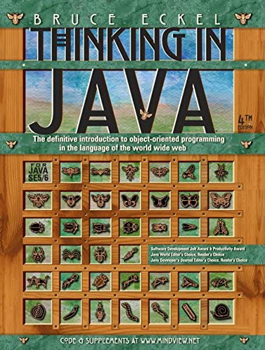

# Introduction

> Name: Richen Chen

## my coding experience
* I have learned a little bit of C++ on my own.
* I am currently learning Java. The book I am reading now is called *Thinking in Java.*


This is a picture of the book, another way to access it is to click [here](book.jpg).

The answers to the exercises in the book can be found through [this](https://github.com/przemyslawmoskal/Thinking-in-Java-Solutions) website.

* My book list :
- [x] C++ Primer
- [ ] Thinking in Java


## What I like about computer science
1. Algorithms
2. Data Structures
3. 
## [a mini program I wrore](main.cpp)
* This is a mini snake game I wrote while learning C++:


```
#include<iostream>
#include<conio.h>
#include <windows.h>
#include<queue>
#include<utility>
using namespace std;

//图形变量
const char WALL = '#';
const char SPACE = ' ';
const char FRUIT = 'F';
const char HEAD = 'x';
const char BODY = '.';

//游戏变量
bool Running;
const int width = 20, height = 20;
int x, y, FruitX, FruitY;
enum Directions {STOP = 0, LEFT, RIGHT, UP, DOWN};
Directions dir;
bool pos[height][width]; //二维数组储存蛇身位置
queue<pair<int, int>> steps;  //队列储存行进轨迹

//设置随机位置的水果
void setFruit() {
    FruitX = rand() % width;
    FruitY = rand() % height;
    //确保水果不生成在蛇身上
    if (pos[FruitY][FruitX]) {
        setFruit();
    }
}

//运行函数
void Setup() {
    Running = true;
    x = width / 2;
    y = height / 2;
    setFruit();
    memset(pos, false, sizeof(pos));
}

void Draw() {
    system("cls"); //清空屏幕

    //打印顶边
    for (int i = 0; i < width + 2; ++ i) {
        cout << WALL;
    }
    cout << endl;

    for (int i = 0; i < height; ++ i) {
        cout << WALL;
        for (int j = 0; j < width; ++ j) {
            if (i == y && j == x) {
                cout << HEAD;
            } else if (pos[i][j]) {
                cout << BODY;
            } else if (i == FruitY && j == FruitX) {
                cout << FRUIT;
            } else {
                cout << SPACE;
            }
        }
        cout << WALL;
        cout << endl;
    }

    //打印底边
    for (int i = 0; i < width + 2; ++ i) {
        cout << WALL;
    }
}

//检测玩家输入
void Input() {
    if (_kbhit()) {
        switch(_getch()) {
            case 'w':
                dir = UP;
                break;
            case 's':
                dir = DOWN;
                break;
            case 'a':
                dir = LEFT;
                break;
            case 'd':
                dir = RIGHT;
                break;
            case 'x':
                Running = false;
                break;
        }
    }
}

//游戏运行判定
void Logic() {
    steps.push({x, y});
    pos[y][x] = true;

    //根据方向移动蛇
    switch(dir) {
        case LEFT:
            x --;
            break;
        case RIGHT:
            x ++;
            break;
        case UP:
            y --;
            break;
        case DOWN:
            y ++;
            break;
    }

    //检测是否咬到自己
    if (dir != STOP && pos[y][x] == true) {
        Running = false;
        return;
    }

    //检测是否吃到水果，是则延长蛇身
    if (x == FruitX && y == FruitY) {
        setFruit();
    } else {
        pair<int, int> temp = steps.front();
        pos[temp.second][temp.first] = false;
        steps.pop();
    }

    //检测是否出界
    if (x < 0 || x >= width) {
        Running = false;
    } else if (y < 0 || y >= height) {
        Running = false;
    }
}

int main() {
    Setup();
    while (Running) {
        Draw(); //绘制新状态
        Input(); //玩家输入
        Logic(); //判定死亡/成长
        Sleep(300);
    }
    return 0;
}
```